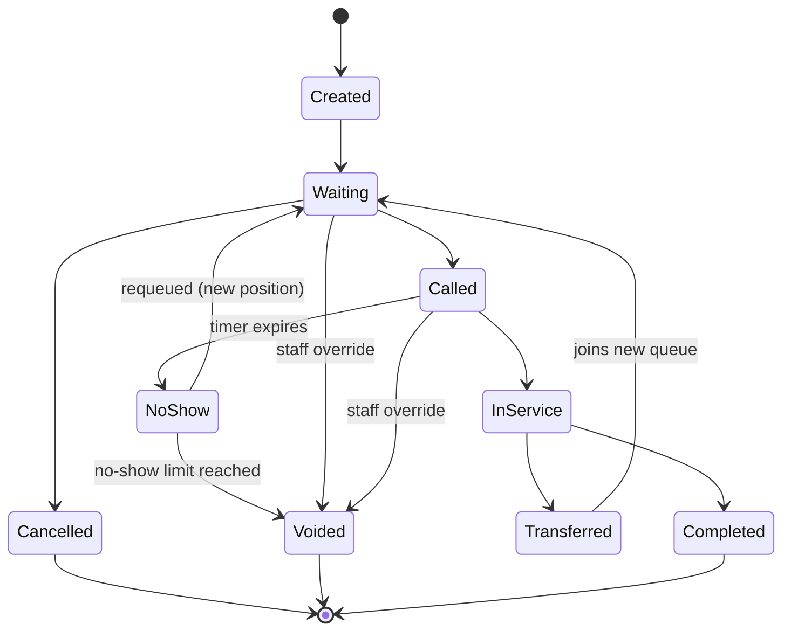
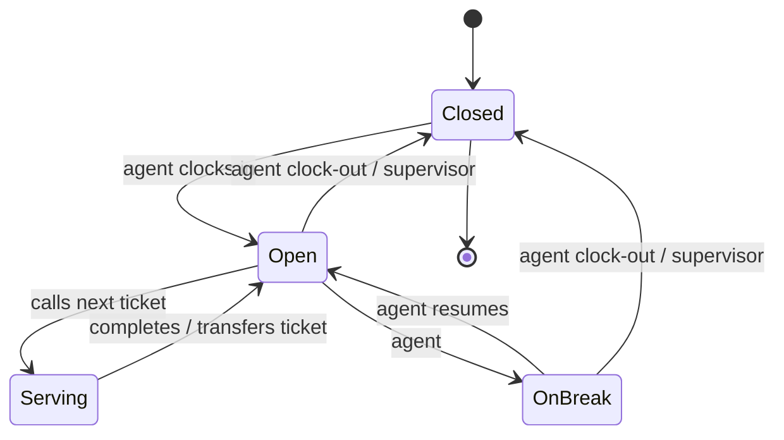
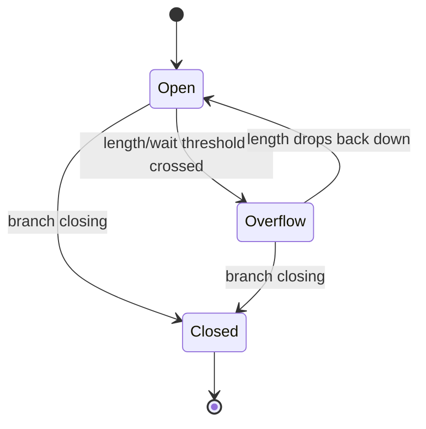
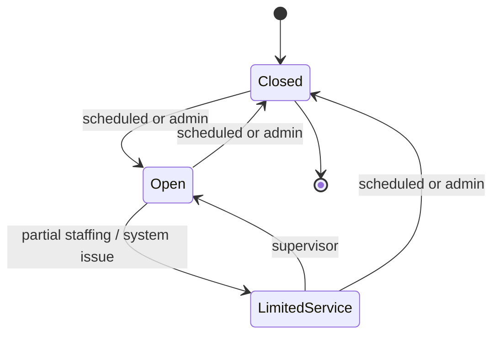
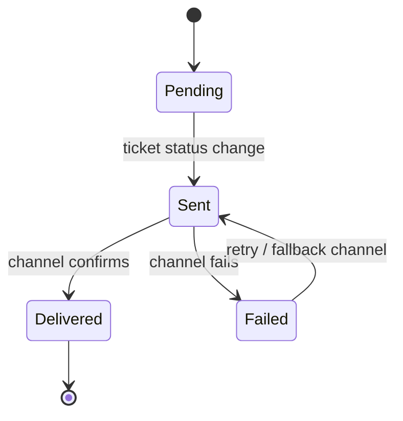

# Queue Management System — Design Notes

A personal project exploring the domain model, entity relationships, and state
machines behind a queue management system (the kind used at banks, clinics,
and government offices).

---

## 1. Users of the System

| User | Goal |
|---|---|
| **Customer / Visitor** | Get served fairly and quickly; know roughly how long they'll wait |
| **Front-desk staff / Receptionist** | Triage customers into the right queue; handle exceptions manually |
| **Service Agent / Teller** | Call the next customer, complete service, transfer when needed |
| **Supervisor / Branch Manager** | Monitor flow — wait times, queue lengths, bottlenecks, staff performance |
| **System Administrator** | Keep the system running — categories, integrations, accounts, hours |
| **Public Display / Notification System** *(implicit)* | Accurately reflect current queue state in real time |
| **Executives / Compliance & Reporting** | Historical accuracy for analytics and audits |

Full breakdown of what each user creates/updates, business rules, failure
modes, and how the system should respond to each is in
[`docs/users.md`](#appendix-user-details) below.

---

## 2. Domain Entities

| Entity | Definition |
|---|---|
| **Ticket** | A single customer's claim on a place in a queue, for one visit, for one service |
| **Queue** | An ordered line of waiting tickets for a specific service category at a specific branch |
| **Counter** | A physical or virtual service point where an agent serves customers |
| **Customer** | The person being served |
| **Branch** | A physical/logical location — the top-level container for a site's operations |
| **Service Category** | A type of service offered (e.g. "account opening"), which determines queue routing |
| **Notification** | A message sent to a customer or staff member about a status change |
| **Audit Log** | An immutable record of every significant action or state change |

Full attribute/behavior/relationship breakdown for each entity is in the
appendix below.

---

## 3. State Machines

### 3.1 Ticket

**Transitions:**

| From | To | Triggered by | Side effects |
|---|---|---|---|
| — | Created | Customer or receptionist | Ticket number assigned, added to Queue, Audit Log entry |
| Created | Waiting | System (automatic) | Position calculated, estimated wait sent to customer |
| Waiting | Cancelled | Customer | Removed from queue, positions recalculated behind them |
| Waiting | Called | Agent (via Counter) | Notification sent, no-show timer starts, linked to Counter |
| Called | In Service | Agent | No-show timer cancelled, timestamp logged |
| Called | No Show | System (timer expiry) | `no_show_count` incremented; Audit Log entry |
| No Show | Waiting | System | Requeued at current position + configurable offset (e.g. +5), new Notification sent |
| No Show | Voided | System | Only when `no_show_count` reaches the configured cap |
| In Service | Completed | Agent | Service duration logged, Counter freed |
| In Service | Transferred | Agent | New Service Category assigned, re-enters Waiting in a different queue |
| Waiting / Called | Voided | Receptionist / Supervisor | Reason required, mandatory Audit Log entry |

**Requeue logic (Option 3 — chosen approach):**
- On a missed call, the ticket returns to `Waiting` rather than expiring outright.
- New position = current queue position at time of recall + a configurable
  offset (e.g. 5 places), not a pre-assigned absolute slot — recalculated at
  recall time since the queue is a moving target.
- `no_show_count` tracks repeat misses; once it hits a configured cap
  (suggested default: 2), the ticket is `Voided` instead of requeued again,
  to prevent one customer cycling through the queue indefinitely.
- Every requeue fires a fresh Notification so the customer isn't left
  wondering why their number disappeared and reappeared.
- Open policy question: does a priority-flagged customer (elderly, disabled,
  pregnant) get the same requeue penalty, or a softer one? This is a business
  decision, not a technical one.

---

### 3.2 Counter

| From | To | Triggered by | Side effects |
|---|---|---|---|
| Closed | Open | Agent or Supervisor | Counter becomes eligible to pull tickets |
| Open | Serving | Agent | Pulls next eligible Ticket, moves it Waiting → Called |
| Serving | Open | Agent | Frees counter to call next ticket |
| Open | On Break | Agent | Stops pulling new tickets, stays assigned |
| On Break | Open | Agent | Resumes pulling tickets |
| Open / On Break | Closed | Agent or Supervisor | Any "Called but not yet In Service" tickets get requeued; Audit Log entry |

---

### 3.3 Queue

| From | To | Triggered by | Side effects |
|---|---|---|---|
| Open | Overflow | System (threshold) or Supervisor | New customers redirected to another branch or extra counter opens |
| Overflow | Open | System or Supervisor | Normal intake resumes |
| Open | Closed | Supervisor | Remaining tickets cancelled or carried over, customers notified |

---

### 3.4 Branch

| From | To | Triggered by | Side effects |
|---|---|---|---|
| Closed | Open | System (scheduled) or Admin | All eligible Queues open, Counters become available |
| Open | Limited Service | Supervisor | Some Service Categories disabled; already-queued customers held or redirected |
| Open / Limited | Closed | System or Admin | All open Queues cascade to Closed |

---

### 3.5 Notification

Failed notifications need a defined retry/fallback policy — e.g. a failed SMS
for "your ticket has been called" should fall back to the physical display
rather than being silently dropped.

---

## 4. Business Rules Summary

- First-come-first-served within a service category, with configurable
  priority weighting for elderly, disabled, or pregnant customers.
- One active ticket per customer identifier (phone/ID) to prevent gaming.
- No-show requeue offset and no-show cap are both configurable, not hardcoded.
- Any manual staff override (reprioritization, void) requires a logged reason.
- A counter can't call a new ticket while another is still `In Service`.
- Closing a counter or queue with people still waiting must trigger explicit
  reassignment — never a silent drop.
- Every ticket state transition is treated as an immutable event in the
  Audit Log, not an overwritten field, so history can always be reconstructed
  for reporting and compliance.

---

## Appendix: User Details

### Customer / Visitor
- **Creates/updates:** Ticket number, service category, timestamp
- **What can go wrong:** Misses their call, takes multiple tickets, picks wrong category
- **System response:** Recall 2–3 times with a grace period; requeue per Option 3 above; block duplicate tickets

### Front-Desk Staff / Receptionist
- **Creates/updates:** Category corrections, notes, manual reprioritization, merged duplicates
- **What can go wrong:** Override abuse, data entry mistakes
- **System response:** Log every override with timestamp + staff ID

### Service Agent / Teller
- **Creates/updates:** Ticket status (called, in-service, completed, transferred)
- **What can go wrong:** Forgets to close a ticket, customer no-shows, connectivity drops mid-transaction
- **System response:** Auto-expire "called" after timer, explicit "customer absent" marking, local state caching

### Supervisor / Branch Manager
- **Creates/updates:** Counter open/close, staff assignments, priority weighting, overflow triggers
- **What can go wrong:** Closes a counter with an active queue, misconfigures priority weights
- **System response:** Warn before closing with pending customers; require reassignment

### System Administrator
- **Creates/updates:** Service categories, integrations, staff accounts/permissions, operating hours
- **What can go wrong:** Botched config change during business hours, permissions error
- **System response:** Staged/tested config changes; strict role-based access control

### Public Display / Notification System
- **What can go wrong:** Sync delay shows a stale number, display disconnects
- **System response:** Push updates rather than poll; audio fallback if screen fails

### Executives / Compliance & Reporting
- **What can go wrong:** Silent data loss when tickets are voided without a proper transition
- **System response:** Immutable event log for every state change
