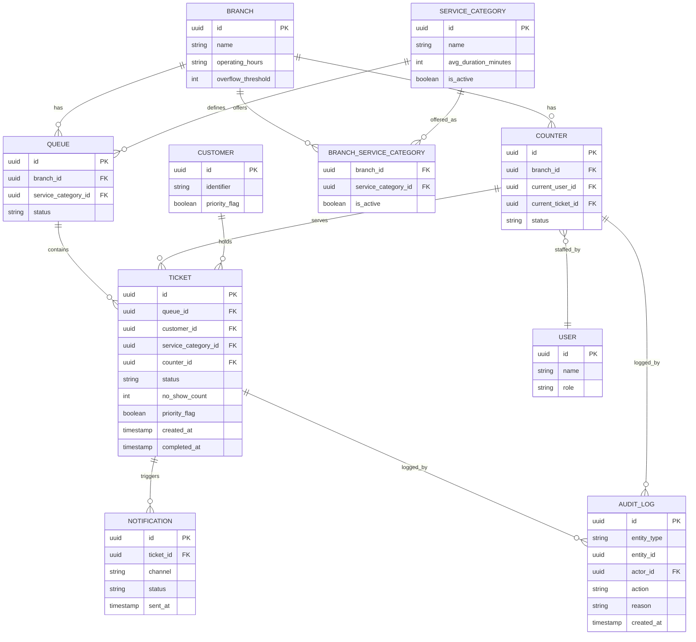

# Schema — Queue Management System

The ERD, and the reasoning behind each design decision — not just what the
tables are, but why they're shaped this way.

---

## Design Decisions

### 1. Service Category — global definition vs. per-branch

A category like "account opening" isn't owned by one branch; several
branches could offer it. Instead of duplicating the category definition on
every branch, it's split into `SERVICE_CATEGORY` (the global definition —
name, average duration) and a join table `BRANCH_SERVICE_CATEGORY` (which
branches currently offer it, and whether it's active there). This directly
supports the "Limited Service disables only selected categories" rule — you
flip one row in the join table, not the category itself.

### 2. No stored `position` column on Ticket

A `position` integer on the ticket row would mean every cancellation in a
40-person queue requires updating up to 39 other rows to shift everyone up —
a write-heavy, race-condition-prone approach. Instead, position is computed
at read time: `ORDER BY priority_flag DESC, created_at ASC` within a queue.
The Queue aggregate still "owns" ordering conceptually, but the database
enforces it structurally rather than through a column kept in sync by hand.

### 3. `Counter.current_ticket_id` alongside `Ticket.counter_id`

Both directions are kept, deliberately. `Ticket.counter_id` records history
(which counter served this ticket, for reporting). `Counter.current_ticket_id`
is the hot-path query ("is this counter free right now?") — and because it's
a single nullable FK rather than a list, "a counter serves at most one
ticket" is enforced by the schema shape itself, not application logic.

### 4. Soft-delete, never hard-delete, on Service Category

Given the rule "a service category cannot be deleted while referenced," the
simplest way to make that unbreakable is to never allow a hard delete at
all — just an `is_active` flag. This sidesteps checking references before
deleting, and keeps historical tickets pointing at a category that still
exists, which compliance reporting needs anyway.

### 5. One generic `AUDIT_LOG` table, not a per-entity log

A dedicated `TicketEvent` table alongside a general audit log would mean two
audit trails to keep consistent. Instead, `AUDIT_LOG` is polymorphic —
`entity_type` + `entity_id` — and captures every entity's history in one
append-only table. Trade-off: a generic `entity_id` can't be a real foreign
key, so referential integrity for audit rows is a convention, not a
database-enforced constraint. Worth naming explicitly rather than hiding,
especially for a compliance-heavy context.

### 6. Enforcing "one active ticket per customer" at the database level

This is a cross-aggregate invariant (spans Customer and Ticket). It's
enforced with a partial unique index —
`UNIQUE(customer_id) WHERE status IN ('waiting','called','in_service')` —
rather than trusted to application code, since two simultaneous requests
could otherwise both pass an in-memory check before either commits.

---

## Entity Relationship Diagram

**Reading the diagram:** `NOTIFICATION` and `AUDIT_LOG` each carry a foreign
key back to the entity that caused them — the domain events pattern from
the aggregates design made literal in table form, where those two tables are
pure consumers, never producers, of state. `TICKET` is the most
heavily-referenced table, which tracks with everything else in this
project — it's the center of gravity of the whole domain, which is why it
got the most attention in the state machine, the aggregate boundary, and the
business rules before ever reaching this schema.
